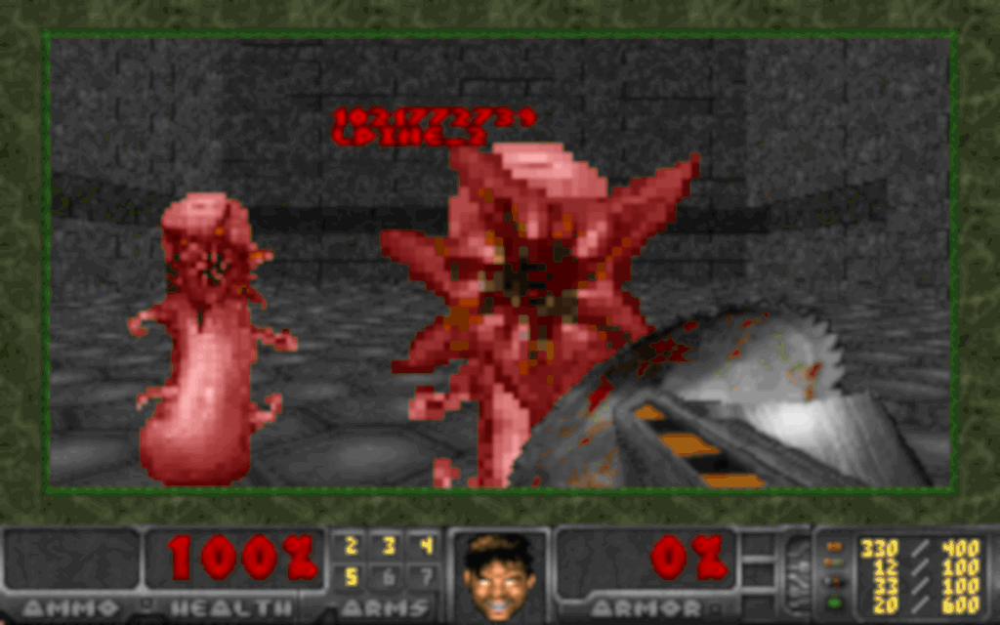

# psdoom-containers



## Installation

```bash
go get -u github.com/baez90/psdoom-containers/cmd/psdoom-containers
```

## Usage

### Docker

```bash
export PSDOOMPSCMD='psdoom-containers docker ps'
export PSDOOMRENICECMD='true'
export PSDOOMKILLCMD='psdoom-containers docker kill'
```

or even more convenient:

```bash
eval $(psdoom-containers docker setup)
```